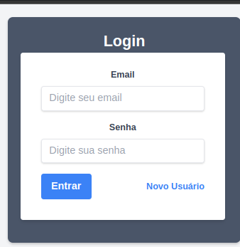

# Projeto Itegrador
```
Disciplina: Projeto Integradie I
Professor: Leonardo G. Lopes
Instituição: Faesa Centro Universitario
```
# Aplicativo de Monitoramento Financeiro

## Descrição do Projeto

Este repositório contém o código-fonte para um aplicativo de monitoramento financeiro desenvolvido como parte de um projeto acadêmico. O objetivo principal do projeto é solucionar um problema financeiro ao permitir que os usuários gerenciem seus gastos de forma eficiente.

O projeto foi dividido em duas etapas:

1. **Apresentação e Promoção da Ideia**: Nesta etapa inicial, foram realizadas palestras e seminários para apresentar a ideia do aplicativo e promover sua utilidade. O objetivo era obter feedback e melhorias por meio do envolvimento da comunidade.
2. **Prototipação do Aplicativo**: Na segunda etapa, o foco foi o desenvolvimento da prototipação do aplicativo. Durante esta fase, as funcionalidades principais foram implementadas para demonstrar o monitoramento financeiro aos usuários.

## Funcionalidades do Aplicativo

O aplicativo oferece as seguintes funcionalidades:

- Pagina de Login:  você clica em Novo Usuário.
 
- 
- Cadastro: Os usuários podem se cadastrar fornecendo seu nome, e-mail e senha, clique em (Faça login).
 
- 
- Registro de Gastos: Os usuários podem inserir e acompanhar seus gastos ao longo do mês.


- Geração de Relatórios: O aplicativo gera relatórios detalhados, apresentando gráficos e barras para visualizar os diferentes tipos de gastos .


## Contribuição

Este projeto é resultado do trabalho realizado durante o período acadêmico, onde a equipe teve a oportunidade de colaborar e contribuir para o seu desenvolvimento. Os arquivos e códigos aqui presentes são uma versão inicial do aplicativo e podem ser aprimorados.

Se você deseja contribuir, sinta-se à vontade para enviar suas sugestões, correções de bugs ou melhorias por meio de pull requests. Todas as contribuições são bem-vindas e apreciadas.

## Como Executar o Aplicativo

Para executar o aplicativo em seu ambiente local, siga os passos abaixo:

1. Clone este repositório em sua máquina local usando o comando:

    ```
    git clone <https://github.com/ifeslopes/projeto_itegrador.git>
    
    ```

2. Navegue para o diretório do projeto:

    ```
    cd nome-do-repositorio
    
    ```
## Link para o aplicativo
[Click Aqui](https://ifeslopes.github.io/projeto_itegrador/).